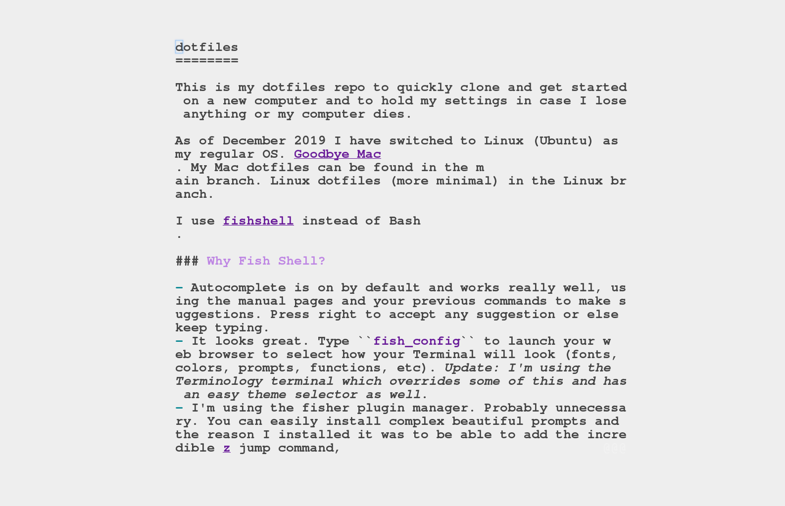

dotfiles
========

This is my dotfiles repo to quickly clone and get started on a new computer and to hold my settings in case I lose anything or my computer dies.

[Dotfiles](https://github.com/webpro/awesome-dotfiles) are a programmer's term for the hidden files that start with a ```.``` stored in the root directory of your computer. They contain custom settings for your operating system and software, especially commandline software. This includes adding special commands, remapping keyboard keys, specifying window sizes, changing sounds, and just generally customizing your computer's defaults. In this repo I have only included dotfiles of things I've customized.

As of December 2019 I have switched to Linux (Ubuntu) as my regular OS. [Goodbye Mac](https://opensource.com/article/20/3/mac-linux). My Mac dotfiles can be found in the main branch. Linux dotfiles (more minimal) in the Linux branch. I also have a Windows Subsystem for Linux branch for use on my Windows machine.

**General notes:** I use [Fishshell](https://fishshell.com/) instead of Bash or Zsh. I type in [Dvorak](https://en.wikipedia.org/wiki/Dvorak_keyboard_layout). I use Neovim and vim-keys. I use the ~~Terminology~~ terminal (update: I primarily use Tilda terminal now. It's fast, and I had a bug with terminology).

  
*Screenshot of my Terminology terminal, showing this document being edited, with :Goyo focuswriter on*

### Why Fish Shell?

- Autocomplete is on by default and works really well, using the manual pages and your previous commands to make suggestions. Press right to accept any suggestion or else keep typing.
- It looks great. Type ```fish_config``` to launch your web browser to select how your Terminal will look (fonts, colors, prompts, functions, etc). *Update: I'm using the Terminology terminal which overrides some of this and has an easy theme selector as well*.
- I'm using the fisher plugin manager. You can easily install complex beautiful prompts and the reason I installed it was to be able to add the incredible [z](https://github.com/jethrokuan/z) jump command, etc. 
- syntax highlighting is amazing. This makes it easy to understand what I'm typing/calling.
- I use vimkeys in Fish so I can use vim commands when composing commands at my prompt. zsh has this too, but Fish shows what mode you are in and autocomplete works well with it.

#### What doesn't work great in Fish shell?

- Fish usually needs to be installed. It's not a built-in shell on Mac, Windows but it does come on some Linux distros. In any case, it's super easy to [install](https://fishshell.com/).
- Ocassionally you actually just want to use some simple Bash commands, particularly with wildcards like ```*``` or ```.``` and Bash has trouble knowing what to do. It'll yell at you. So then i just type ```bash``` to get into a temp bash shell, and then ```exit``` when I'm done.
- ~~I still write Bash scripts instead of fish shell scripts. I add the bash shebang to the top so runs fine.~~ Update: I enjoy writing fish scripts now! Simpler, less obscure Bash-y syntax!
- Even though it's easy to install and makes the command line simple, I prefer to teach Bash to students first since they should know it when they jump on a new machine without Fish.

### Essential programs for me

Keep in mind I'm an artist, not a developer. I write text most days, work on creative coding and interactive and web-based art, build sites, create tools, read, make music, etc.

- ```nvim``` the Neovim text editor. 
- ```z``` directory jumping navigation. I use this instead of ```cd``` much of the time. [info](https://github.com/jethrokuan/z)
- ```tldr``` command line helper which lists how to use most command line software. [info](https://tldr.sh/)
- ```gcalcli``` which can display, edit and add to my google calendar. [info](https://github.com/insanum/gcalcli)
- ```vimwiki``` which I use to create and edit a huge personal wiki file for notes, brainstorming, copying down info, listing movies to watch, books I've read, etc etc. [info](https://opensource.com/article/18/6/vimwiki-gitlab-notes)
- ```dreams``` quick shortcut to open my dreams journal textfile
- ```pyradio``` which I use to stream music. See [my article](https://opensource.com/article/19/11/pyradio).
- ```apt``` package manager for Ubuntu. *Previously on the Mac I used ```brew``` package manager.*
- ```git``` version control system. I use both GitHub and [Keybase's encrypted Git](https://keybase.io/blog/encrypted-git-for-everyone).

# My PATH
The PATH tells your computer where your custom software is located, so that you can launch it by typing its name instead of having to execute it from its specific directory. *(i.e. You can type ```my-program``` instead of ```./my-program.sh``` for example.*

In fish, you add to your PATH in `config.fish`, not bashrc or `.bash_profile.` Custom programs can be placed in the bin folder, which can be added to the PATH inside config.fish.

# Aliases / Fish Functions
In Bash we have aliases, but Fishshell calls them functions. Check them out inside /fish/functions. These are used to simplify or improve specific commandline calls.

*Update: I used to have a ton of functions for launching radio stations, rendering text, etc. Have simplified and eliminated most of these on my Ubuntu machine (for example by using the pyradio program now) but they are still on my Mac found in the main branch under fish/functions*.

Current-ish list:
- ```agenda``` - prints my weekly google calendar schedule, using gcalcli
- ```av98``` - launches the experimental simple commandline AV-98 Gemini Protocol browser
- ```bandcamp``` - specify url of bandcamp album to play on the commandline via player. no error handling at this point. PgUp/PgDown to navigate tracks.
- ```brogue``` - had to modify some makefile and config to get this roguelike game to work in ubuntu. This shortcut launches the modified game.
- ```bsdgames``` - I can't remember all the games installed with bsdgames individually, so this just lists them for me. For example, ```adventure``` for Colossal Cave Adventure, ```backgammon```, ```hack``` roguelike game, ```robots``` Dalek game, ```cribbage``` card game, ```monop``` commandline monopoly, ```tetris-bsd```
- ```calm``` - plays some brown noise with sox, sounds like calm ocean waves
- ```filecount``` - basically a one-liner that uses wordcount to count the number of files in your current folder.
- ```fisher``` - installed when you install [fisher](https://github.com/jorgebucaran/fisher) Fish package manager. ```fisher add [packagename]```. Find packages [here](https://github.com/jorgebucaran/awesome-fish). ```fisher ls``` to list installed.
- ```food n``` - adds date and time and specified food n to a simple csv file at ~/.food (for tracking meals)
- ```make-website n``` - copies over a starter html, css, js to the specified named directory, creating it if needed
- ```minilog``` - shortcut to my minilog micro-journal (takes message, log or help flags)
- ```open``` - mimics the Mac open command. Essentially just an alias to Linux equivalent ```xdg-open```.
- ```rm``` - this adds a **"are you sure?"** prompt when I try to delete anything in the Terminal. Can be over-ridden with ```rm -rf``` if I'm really surely surely sure.
- ```vim``` - remap so instead launches Neovim. (If I ever actually wanted to just run vim I could type ```vi``` which is automatically redirected on ubuntu, but that never happens)!
- ```vimwiki``` - launches my vimwiki in Neovim
- ```weather``` - runs curl to pull down the weather from wttr.in - location i think determined via ip address?
- ```z [directory]``` - this *essential* function is actually installed through [fisher](https://github.com/jorgebucaran/fisher). It lets you type ```z homework``` and it auto ```cd``` jumps you into the proper folder.

## Neovim
I've switched to Neovim from Vim for text editing/coding/etc which I use like an IDE. Instead of a .vimrc I have an init.vim file. It needs to be placed in ~/.config/nvim . I am using the [Plug](https://github.com/junegunn/vim-plug) plugin manager, which gets called in my init.vim file. I set neovim (nvim) as the $EDITOR in the .fish_config file. I have a function that launches nvim when I type vim. My init.vim is fully commented, so you can look at the details there.

I never learned tmux terminal multiplexer or properly managing buffers in Vim/Neovim. Instead I just open new tabs in my terminal, switch between them with the Alt keys, and can copy and paste between them using the normal y/ank and p/aste because of a setting I added to my Neovim config in my init.vim file that lets me paste text from anywhere on my computer inside Neovim now. You can take a look at my init.vim file for this.

I type in Dvorak on my computer and I've found Dvorak is fine for Vim without any need for remapping keys. Have used this setup for years; no complaints.

Plug-ins
- [Goyo](https://github.com/junegunn/goyo.vim) - minimalist writing app. ```:Goyo``` to toggle it on/off.
- [Vimwiki](https://vimwiki.github.io/) - a vim-based personal wiki / knowledge repository. I use this extensively but it's for internal use only on my own machine. ```\ww``` (aka 'leader-w-w') to turn on, or my shortcut function ```vimwiki``` to jump into it.
- [vim-sensible](https://www.vim.org/scripts/script.php?script_id=4391) - provides sensible basic defaults in vim. Includes: backspace in insert mode, begin search while typing out match string, make whitespace prettier, show at least one line above cursor, autoload file changes, improve finding matching open and close tags
- [Nerd-Tree](https://github.com/scrooloose/nerdtree) - make vim work more like an IDE with left-side file view. I added a shortcut so *Control-N* toggles the filetree open and closed. Without that you have to type ```NERDTreeToggle``` (case-sensitive) and it's not clear to me how to change this to remap to ```:tree``` instead.
- [Sonic Pi](https://github.com/dermusikman/sonicpi.vim) - used to run Sonic Pi (livecoding music software) from Vim instead of its own application. Still requires the original Sonic Pi software to be open/running. This acts as alternate frontend.
- [Markdown Preview](https://github.com/iamcco/markdown-preview.nvim) - Replaces Mou, Macdown, and Markdown preview that I was previously using in Atom. Runs very fast. Starts a local server and opens your browser to preview Markdown as you're writing it live. Scrolls the webpage for you too as you move up and down in your document! Since I'm writing in Markdown all the time this plugin is a must! ```:MarkdownPreview``` to begin.

When I want to add a new plugin I simply add a single line to my init.vim file, then run ```:PlugInstall``` and it downloads into the proper folder.

Custom commands:
- I've added ```:Scratchpad``` to my init.vim for Neovim so that I can pull up a simple web-based scratchpad when I need to draw something. [vwscratchpad repo](https://tildegit.org/exquisitecorp/vwscratchpad)

## Atom for IDE and custom Markdown editor
vim-mode and ex-mode plugins for me, liveserver, Zen focuswriter, teletype for collaborative editing. I mostly use Neovim instead unless I'm teaching students.

## TLDR

Can't remember how to do something in the terminal but know the name of the app? Then use **TLDR**.

Example: ```tldr ls```

Lists the most common uses for a command.

I contributed the file for how to use ```gcalcli```, the command-line client for google calendar. Run ```tldr gcalcli``` to see my handiwork.

## Images in the Terminology Terminal

Terminology terminal lets you view image files in the browser.

- ```tyls``` - List/display all files in the current directory and show thumbnail image
- ```tycat filename``` - Display filename in the Terminal. You can even do ```tycat *.jpg``` for example to see all of the images in your current directory displayed large in the Terminal. 

